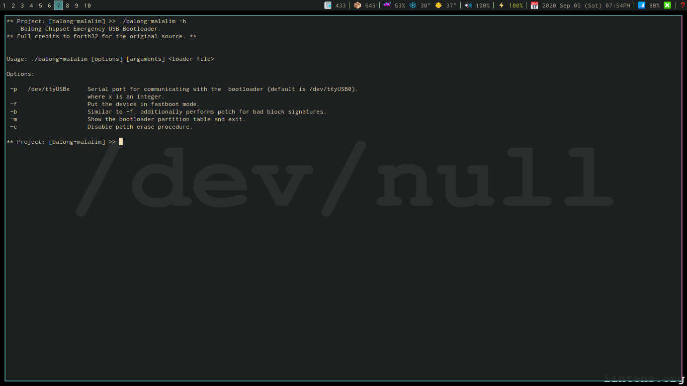
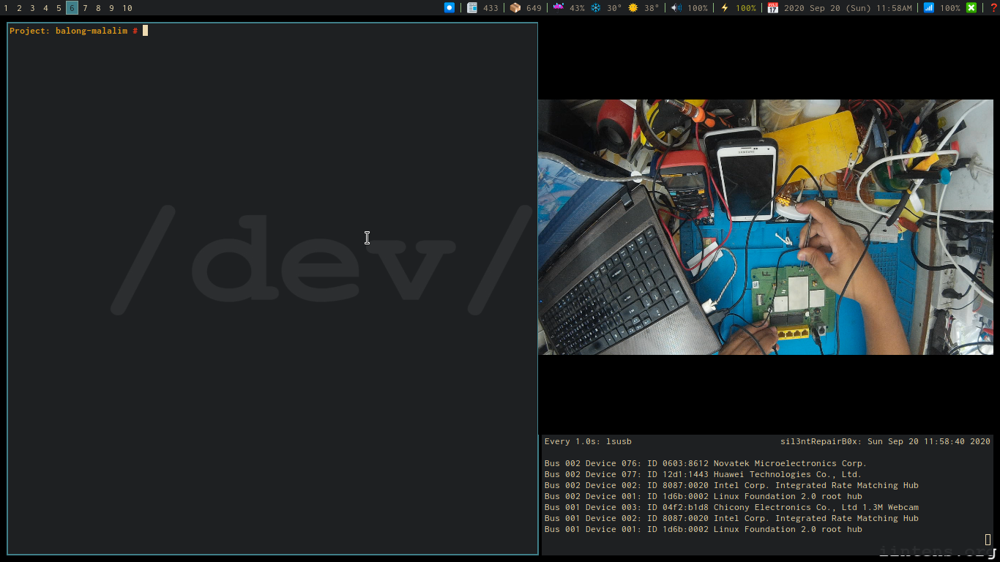
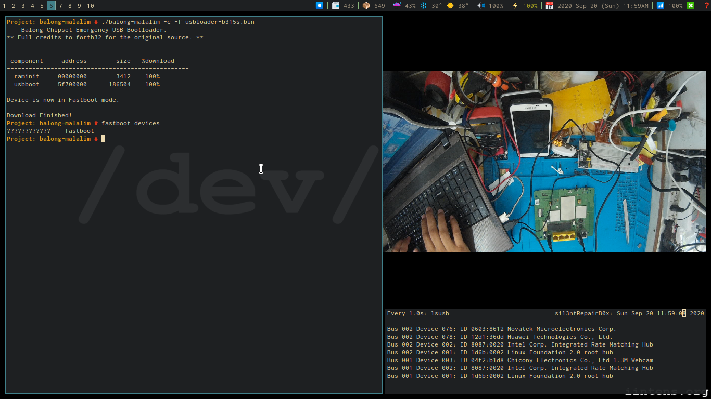

# balong-malalim

Taken from the README of [**forth32's
repo**](https://github.com/forth32/balong-usbdload).

> *Balong-usbdload* is an emergency USB boot loader utility for Huawei LTE modems and routers with Balong V2R7, V7R11 and V7R22 chipsets.  
It loads external boot loader/firmware update tool file (usbloader.bin) via emergency serial port available if the firmware is corrupted or boot pin (test point) is shorted to the ground.
> 
> **This utility can make your device unbootable!**  
Use it only if you fully understand all risks and consequences. In case of any issues, you're on your own. Do not expect any help.

**balong-malalim** is a utility very similar to *balong-usbdload*. This utility is the
result of
[this](https://zer0325.github.io/2020/09/04/Analyzing-forth32's-balong-usbdload-software.html).
Similar to *balong-usbdload*, it has the following disclaimer:

> **This utility can make your device unbootable!**  
Use it only if you fully understand all risks and consequences. In case of any issues, you're on your own. Do not expect any help.

All the functions present in *balong-usdbload* is also present in
*balong-malalim*, except the functions for the `-t` and `-s` options. 

### Where to get USB loader files (usbloader.bin)

Some USB loaders are available in
[this](https://github.com/forth32/balong-usbdload) repository, along with patched versions (usblsafe.bin).

## Screenshots

Output of `$ balong-malalim -h`

Output of `$ balong-malalim -m usbloader-b310.bin`

Screenshot while performing testpoint.

Output of `# balong-malalim -c -f usbloader-b315s.bin`

